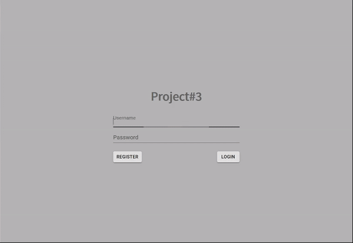
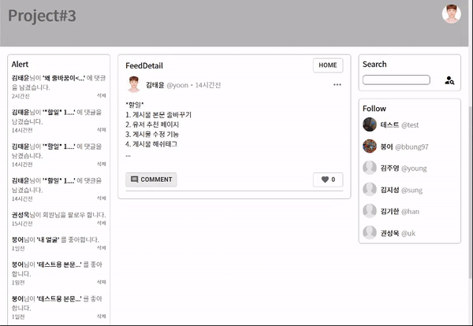
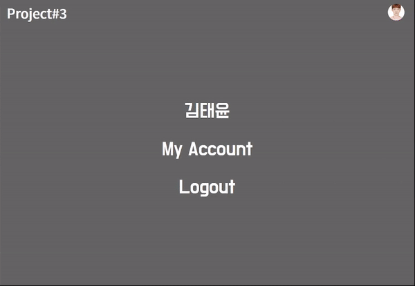

<h1>Project#3</h1>
작성: 2021-01-15 15:30<br>
(수정: 2021-01-15 15:30)<br>
<br>

<h2>서론</h2>
<p>Project#3는 일반적인 SNS의 기능을 따라해보고자 내가 만든 세번째 웹앱이자 그나마 어느정도 완성한 첫번째 웹앱이다. 이 프로젝트는 React로 작성된 frontend와 Django로 작성된 backend로 동작한다. 원하는 기능을 구현하는데 오픈소스를 최대한 사용하지 않으려고 했으며 대부분의 기능을 직접 구현했다. 일반적인 CRUD를 모두 구현했으며, 이미지 슬라이더, 피드 무한 스크롤 등 그 외의 기능을 더 추가하려고 노력했다.</p>

<h2>구현<h2>





<h2>API</h2>

| 주소                  | API    | 기능                                          |
| :-------------------- | :----- | :-------------------------------------------- |
| /api/auth/signup/     | POST   | 회원가입                                      |
| /api/auth/login/      | POST   | 로그인                                        |
| /api/auth/logout/     | POST   | 로그아웃                                      |
| /api/auth/logoutall/  | POST   | 모든 기기에서 로그아웃                        |
| /api/auth/userinfo/   | GET    | 토큰으로 로그인한 유저 정보 가져옴            |
| /api/auth/userdetail/ | GET    | 특정 유저 정보 가져옴                         |
| /api/auth/follow/     | POST   | 팔로우                                        |
| -                     | DELETE | 언팔로우                                      |
| -                     | GET    | 팔로우하는 유저 모두 가져옴                   |
| /api/auth/searchuser/ | GET    | 검색된 유저 가져옴                            |
| /api/feed/            | POST   | 피드 포스팅                                   |
| -                     | GET    | 팔로우한 계정의 피드를 5개씩 가져옴           |
| -                     | DELETE | 피드 삭제                                     |
| /api/feeddetail/      | GET    | 특정 피드 한 개 가져옴                        |
| /api/userfeed/        | GET    | 특정 유저의 피드를 5개씩 가져옴               |
| /api/comment/         | GET    | 특정 피드의 댓글 가져옴                       |
| -                     | POST   | 댓글 포스팅                                   |
| -                     | DELETE | 댓글 삭제                                     |
| /api/like/            | POST   | 특정 피드 좋아요(이미 LIKE인 경우 Like 삭제)  |
| /api/alertfeed/       | GET    | 특정 유저의 알림을 가져옴                     |
| -                     | POST   | 알림을 checked 상태로 변경                    |
| -                     | DELETE | 알림 삭제                                     |
| -                     | 비고   | alertfeed는 댓글, 좋아요, 팔로우 시 자동 생성 |

<h2>개선점</h2>

<li><strong>div tag 남용</strong></li>
div를 이용해서 css 정리를 시도했으나 깔끔하게 정리하지 못해서 div태그가 너무 많이 남용됐다.<br>
<br>
<li><strong>React hooks useContext, useReducer 성능개선 필요</strong></li>
useContext와 useReducer를 사용하는 과정에서 rerender될 필요없는 컴포넌트까지 rerender가 일어나서 성능에 악영향을 줄 수 있는 상황이 발생하는 것 같다. 신경써서 코드 작성할 필요성이 있다.<br>
<br>
<li><strong>Django many to many field 사용</strong></li>
many to many field의 존재를 늦게 알아서 거의 사용하지 못했다. 다대다 관계에서 사용하면 더 효율적인 db구성 가능.<br>
<br>
<li><strong>코드 작성 전 자료구조 및 논리 먼저 생각하기</strong></li>
기능을 머리 속으로 생각하고 바로 코드를 작성하게 되면 추후 모델이나 db구조를 수정하거나 수정해야하지만 수정하지 못하는 결과가 발생한다. 이럴 경우 추가적인 db를 만들어야 하기 때문에 더 큰 노력이 들어가고 시스템도 복잡해지게 된다. 반드시 코드 작성 전 원하는 기능을 구조화해서 생각해볼 것.<br>
<br>
<li><strong>재사용 가능한 코드 작성하기</strong></li>
위에서 말한 것과 같이 당장 필요한 기능만 대충 구현해서 만들게 되면 비슷한 기능이 필요할 때 이미 만들어 놓은 기능을 이용하지 못한 채 새로 기능을 구현해야함. 기능을 만들 때에는 재사용 가능하고 쉽게 확장 가능하게 만들 것.<br>
<br>

<h2>실행</h2>
Django 서버만 실행하면 된다.<br>
<br>

```
pip install -r requirements.txt
```

```
python manage.py runserver
```
